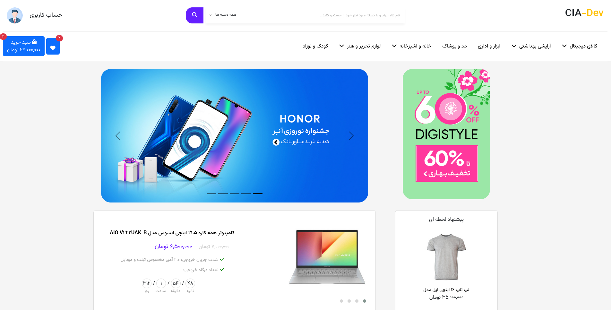
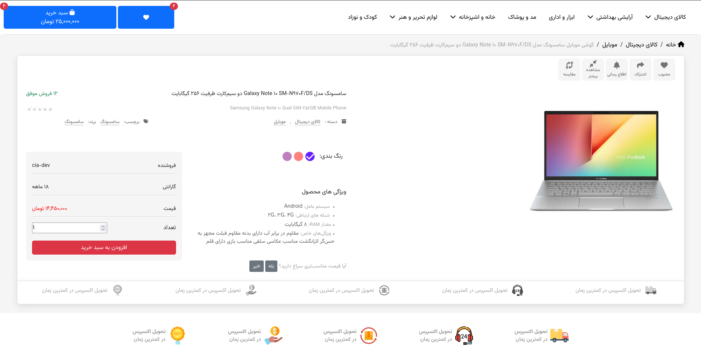
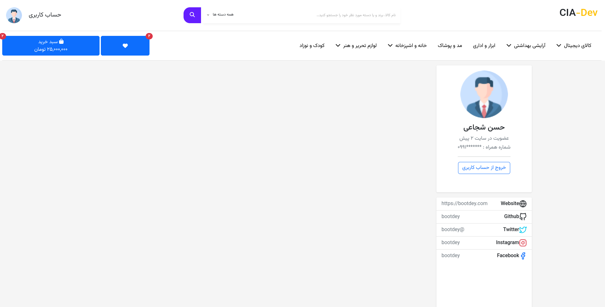

# قالب فروشگاهی 

قالب فروشگاهی بوت استرپ 5.2 , راست چین بهینه سازی شده و شکیل.

##  اسکرین شات ها

<h2>خانه</h2>

<h2>خرید محصول</h2>

<h2>پروفایل</h2>

##  استفاده
برای استفاده از پروژه کافیست نسخه فشرده را دانلود کرده و در ترمینال پکیج های npm را نصب کنید

## صفحات 
- [index](https://github.com/CIA-dev/Shop/index.html)
- [buy](https://github.com/CIA-dev/Shop/Single.html)
- [profile](https://github.com/CIA-dev/Shop/profile.html)

## امکانات 

- بوت استرپ 5.2
- 3 صفحه آماده (خانه , خرید محصول , پروفایل)
- کلاس های آماده
- سهولت در استفاده
- پشتیبانی از مرورگر های (Chrome, Firefox, Opera, IE11, Safari)
- تمام ریسپانسیو
- و ...

## گزارش برخی از اشکالات
در صورت پیدا کردن اشکال در پروژه , خوشحال میشویم که آنرا در بخش [create an issue](https://github.com/CIA-dev/Shop/issues)
با ما درمیان بگذارید تا در کنار هم آنهارا رفع کنیم

## لایسنس 
[GNU License](http://opensource.org/licenses/GNU)

---

Made With Love ❤️

